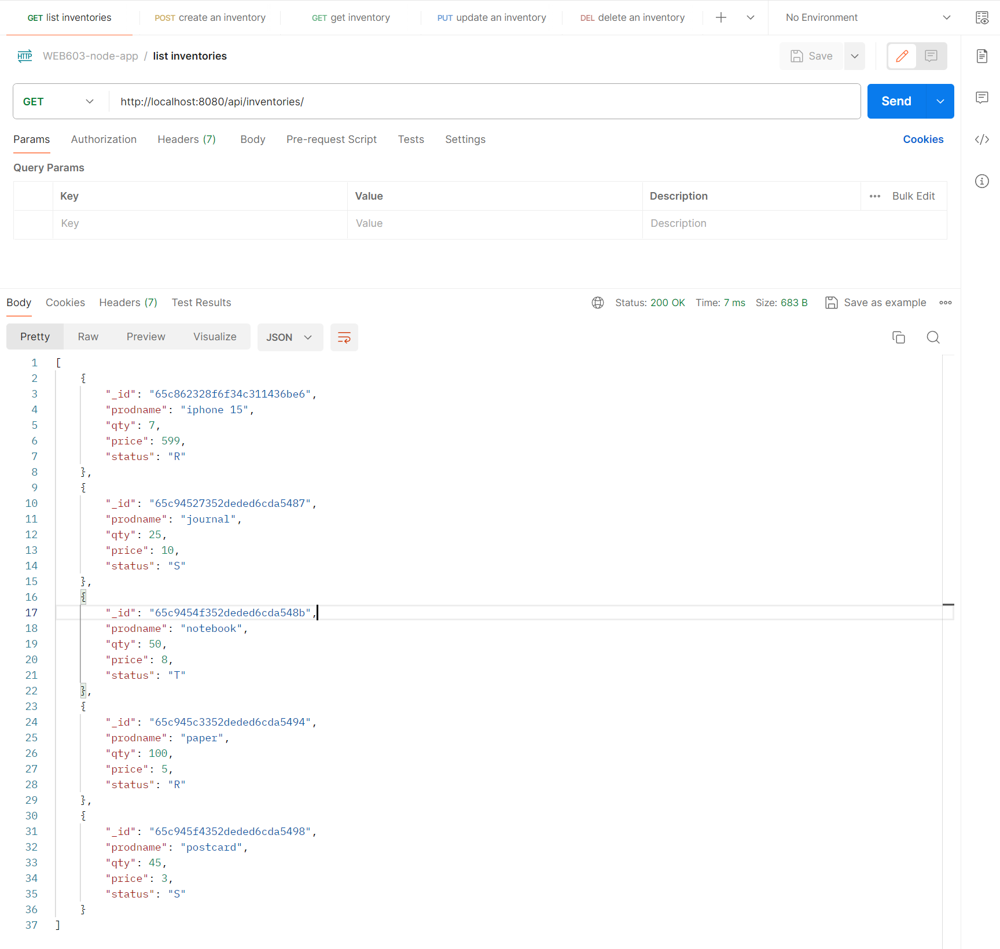
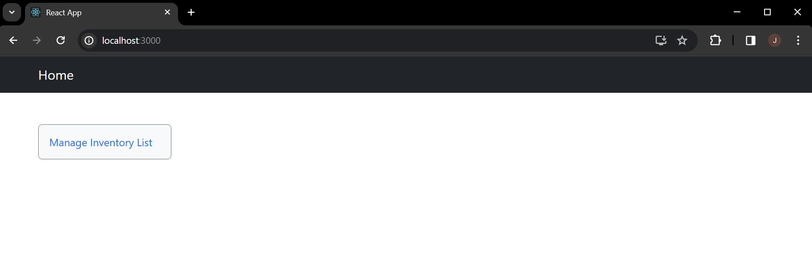
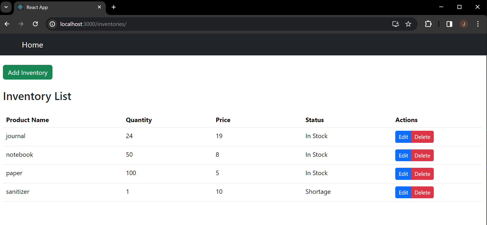
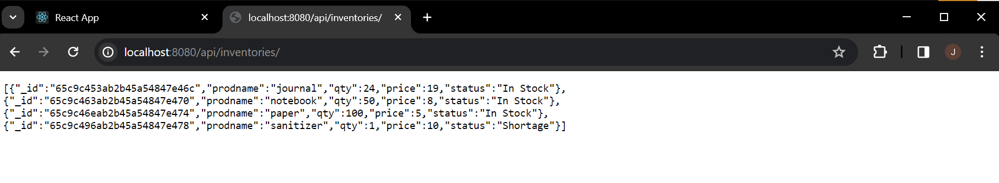
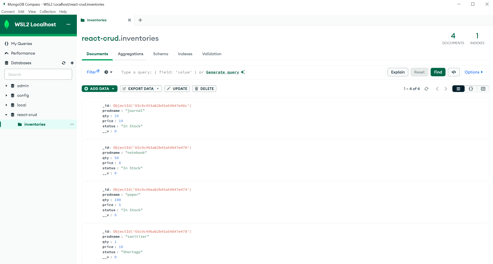
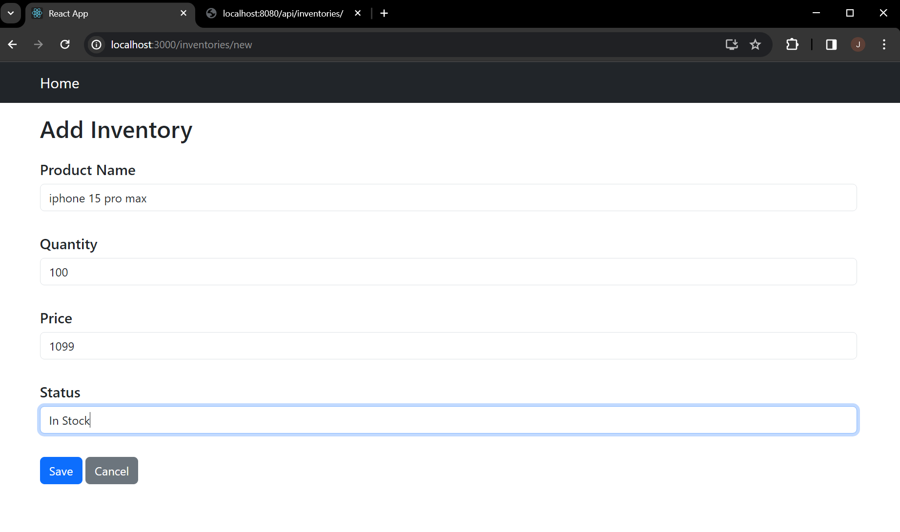
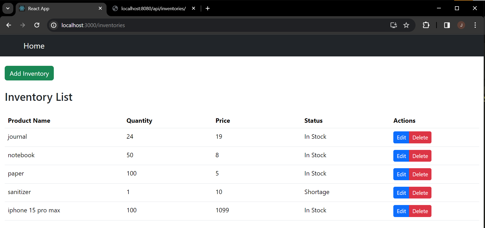
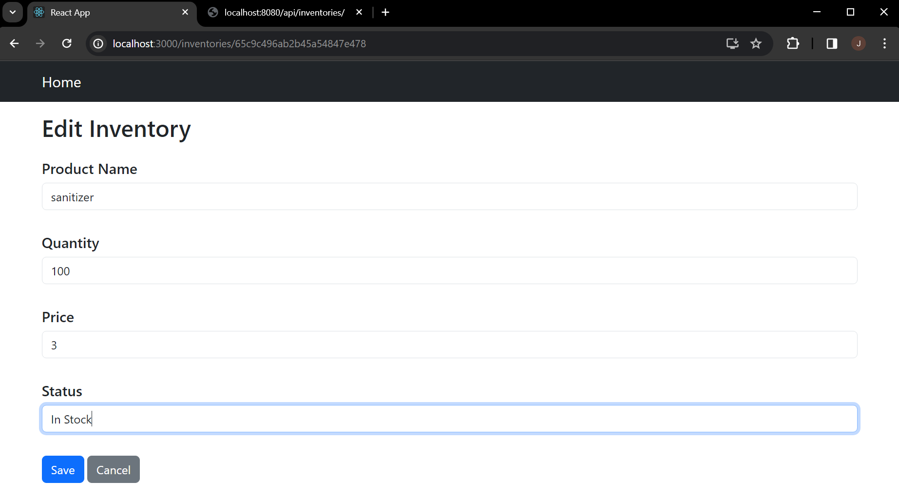
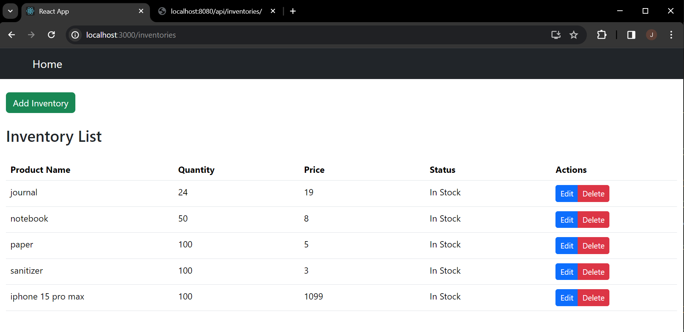
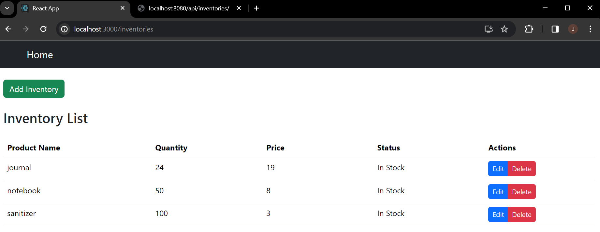

# web603-hw-w5d2

## Description
In `web603-hw-w5d1` ("previous work"), the **backend** part of the Inventory Management application has been completed. It uses Express JS framework and MongoDB as the database. All backend work is under the directory `node-mongo/`.

This repo continues the development work by adding the **frontend** part of the application. It will use React JS framework. All frontend work will be under the directory `react-app/`.

## Before Getting Started

### Step 1: Replicate Previous Work
Copy and paste all app-related files in `web603-hw-w5d1/node-mongo/`, except `node_modules/` and `package-lock.json`. 

With `node-mongo/` as the current directory, simply run `npm install` because `package.json` should have all required dependencies added already. 

### Step 2: Connect to MongoDB and Start the App

First, start MongoDB service as a daemon process by running
```bash
$ mongod
```
or if you are running it on WSL2:
```bash
$ mongod --bind_ip 0.0.0.0
```

Then in another terminal run `npm start`. 

Use `curl` or Postman to make sure all endpoints are working correctly as before. For example:



#### *Using MongoDB Compass for WSL2 Users*

If you are using MongoDB Compass to connect to the MongoDB instance in WSL2, you might need to use your real IP address instead of `localhost`.

Grab your IP address by running the following in the WSL2 terminal:
```bash
$ ip addr | grep eth0
```

The IP address might be different from what's being used in `web603-hw-w5d1/node-mongo/.env`. Edit `DATABASE` in the `.env` file if necessary, and use that IP address in MongoDB Compass. Once connected, you should see the `react-crud` database created in the previous homework.

## Getting Started

### Step 1: Create the React App

With `web603-hw-w5d2` being the current directory, create the React app named "react-app" by

```bash
$ npx create-react-app react-app
```

### Step 2: Install Dependencies

With `react-app/` being the current directory, install the following modules by

```bash
$ npm install bootstrap react-cookie react-router-dom reactstrap
```

### Step 3: Configure Proxy

In `react-app/package.json`, add "proxy" like the following:
```JSON
{
  "name": "react-app",
  ...
  "proxy": "http://localhost:8080",
  ...
}
```

The purpose of adding proxy config is to allow us to run both front-end React application and back-end API server during development without running into cross-origin resource sharing (CORS) issues.

It's a common practice in many React development environment, especially those created with Create React App (CRA).

## Test

### Home Page
URL is `http://localhost:3000/`.

Clicking the "Manage Inventory List" button should direct users to the Inventory List page.

### Inventory List
URL is `http://localhost:3000/inventories/`.

Front-end



Back-end



Database



### Add Inventory
URL is `http://localhost:3000/inventories/new`. Title is "Add Inventory".



Inventories after clicking the "Save" button to add inventory:



### Edit Inventory

Click the "Edit" button for the row "sanitizer".

URL is `http://localhost:3000/inventories/${some_id}`. Title is "Edit Inventory".



Inventories after clicking the "Save" button to edit inventory:



### Delete Inventory
Click the "Delete" button to delete an inventory.



## Side Notes

### 1. More RESTful

Endpoints are slightly adjusted to make the application more RESTful:

```markdown
# create inventory:
Frontend:  /inventories/new
Backend:   POST /api/inventories/new

# get inventory
Frontend:  N/A
Backend:   GET /api/inventories/${id}

# list inventories
Frontend:  /inventories/
Backend:   GET /api/inventories/

# update inventory
Frontend:  /inventories/${id}
Backend:   PUT /api/inventories/${id}

# delete inventory
Frontend:  N/A
Backend:   DELETE /api/inventories/${id}
```

### 2. Refactoring Work

`InventoryEdit.js` and `InventoryList.js` were refactored to make them properly work with React Router v6. 

The latest version of React Router does away with the `match` props and now uses hooks for route matching. For example:

- The `useParams` hook is used to access the route parameters.

- The `useNavigate` hook is used to programmatically navigate to the inventory list after a successful save or cancel action.

- The `useState` hook replaces the class component's `state` and `setState` for managing the component's state.
